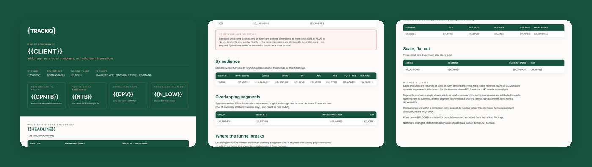

# TrackIQ: Amazon DSP Audience and Creative Performance

`get_dsp_performance` takes a `dimension` argument that almost nothing uses: `audience`, `creative`, `inventory`, `technology`, `geography`. That is a whole data surface sitting unexamined in most accounts.

**Which audience segments convert, which creatives carry them, and which supply sources waste impressions.**

Part of **Amazon AMC & DSP** in the
[TrackIQ skills catalog](https://github.com/TrackIQ-HQ/amazon-seller-skills).

Built as an [Agent Skill](https://code.claude.com/docs/en/skills). Runs in
Claude Code, Claude web, Claude desktop and ChatGPT from the same folder.

---

## Powered by the TrackIQ MCP

[](https://trackiq.com/mcp)

This skill reads your live Amazon account through the
**[TrackIQ MCP](https://trackiq.com/mcp)** — 16 tools connecting your AI
assistant to Amazon data:

Sales & Traffic · Orders · Inventory · Returns · Sponsored Products · Sponsored
Brands · Sponsored Display · Amazon DSP · AMC Cloud · Keywords · Search Terms ·
Targeting · Search Query Performance · Organic Rank · Best Seller Rank · Buy Box
History · Brand Analytics · Export

Works with Claude, ChatGPT and Cursor. **[Get access →](https://trackiq.com/mcp)**

---

## What you get



Breaks Amazon DSP down by audience, creative, inventory source, technology and geography to show which segments actually recruit customers and which burn impressions. Ranks on new-to-brand purchases, detail page views and cost per action rather than ROAS, because DSP revenue is not returned at these dimensions. Use when the user asks about DSP performance, which audiences work, creative performance, DSP audiences, supply or inventory sources, where DSP budget is going, or why DSP is or is not working.

### The rules that keep it honest

- **`sales` is 0.0 and `units` is "0" on every row at these dimensions**
- **Never sum segments to a total**
- **Rank on new-to-brand purchases first**
- **Report cost per action, not efficiency ratios**

The full list is in `SKILL.md`, and each one exists because getting it wrong
produces a confident, wrong answer rather than an obvious error.

## Requirements

- The TrackIQ MCP, for `list_marketplaces` and `get_dsp_performance`. - **A DSP account with spend in the window.** Not every account runs DSP. Check before promising a report. - Nothing else. No filesystem, no shell, no internet. - **Without the MCP:** works from a DSP report export broken out by the same dimensions.

---

## Install

### Claude Code

```
/plugin marketplace add TrackIQ-HQ/amazon-seller-skills
/plugin install trackiq-amazon-dsp-performance@trackiq
```

### Claude web, desktop, mobile

1. Download the `.zip` from the
   [latest release](https://github.com/TrackIQ-HQ/trackiq-amazon-dsp-performance/releases)
2. **Settings → Capabilities → Skills** (code execution must be on)
3. **Create skill → Upload a skill**, choose the `.zip`
4. Toggle it on

### ChatGPT

Same zip. **Plugins → Skills → Create → Upload from your computer.**

---

## Setup

Answers live in `account.md`, copied from
[`assets/account.example.md`](skills/trackiq-amazon-dsp-performance/assets/account.example.md).
**Every TrackIQ skill reads the same file**, so an account already set up for
another TrackIQ report needs nothing added.

## Delivery

Asked once and stored in `account.md`: **in-chat** (default), **file**,
**Slack**, **n8n** or **email**. Anything leaving the chat confirms with you
first and falls back to in-chat, with a note.

---

## Customizing

| File | What it controls |
|---|---|
| `checks.md` | the pre-send checks |
| `method.md` | the method and every threshold |
| `pulls.md` | the call sequence and its traps |
| `report-template.html` | the report shell |

---

## Contributing

```bash
python scripts/validate.py    # must exit 0 before any commit
python scripts/build.py       # writes dist/ zip + registry.json
```

Read [AUTHORING.md](https://github.com/TrackIQ-HQ/amazon-seller-skills/blob/main/AUTHORING.md)
before proposing changes.

## License

MIT. See [LICENSE](LICENSE).
